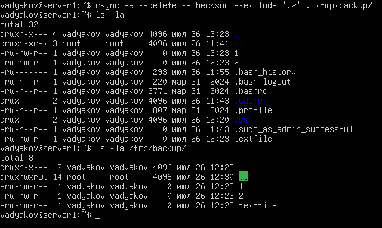
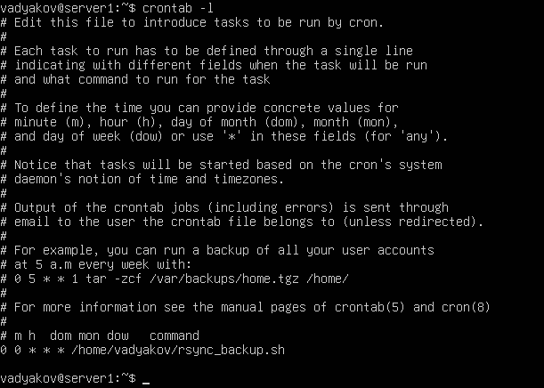
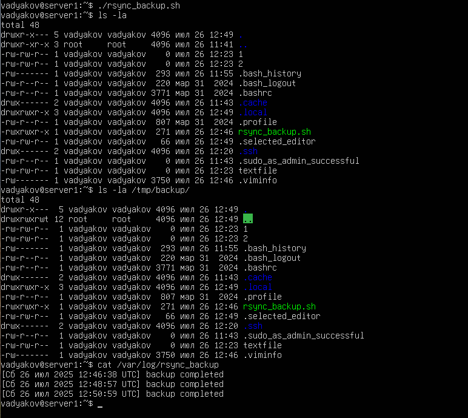
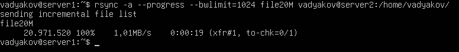
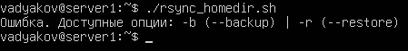
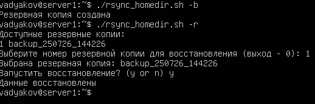

# Домашнее задание к занятию 3 «Резервное копирование» - Дьяков Владимир

### Задание 1

- Составьте команду rsync, которая позволяет создавать зеркальную копию домашней директории пользователя в директорию `/tmp/backup`
- Необходимо исключить из синхронизации все директории, начинающиеся с точки (скрытые)
- Необходимо сделать так, чтобы rsync подсчитывал хэш-суммы для всех файлов, даже если их время модификации и размер идентичны в источнике и приемнике.
- На проверку направить скриншот с командой и результатом ее выполнения

**Решение**

```bash
rsync -a --delete --checksum --exclude '.*' ~/ /tmp/backup/
```



---

### Задание 2

- Написать скрипт и настроить задачу на регулярное резервное копирование домашней директории пользователя с помощью rsync и cron.
- Резервная копия должна быть полностью зеркальной
- Резервная копия должна создаваться раз в день, в системном логе должна появляться запись об успешном или неуспешном выполнении операции
- Резервная копия размещается локально, в директории `/tmp/backup`
- На проверку направить файл crontab и скриншот с результатом работы утилиты.

**Решение**

crontab:



rsync_backup.sh:

```bash
#!/bin/bash

SOURCE_DIR=/home/vadyakov/
TARGET_DIR=/tmp/backup/

rsync -a --delete --checksum "$SOURCE_DIR" "$TARGET_DIR"

if [[ $? -eq 0 ]]; then
        echo "[$(date)] backup completed" >> /var/log/rsync_backup
else
        echo "[$(date)] backup error" >> /var/log/rsync_backup
fi
```



---

### Задание 3*

- Настройте ограничение на используемую пропускную способность rsync до 1 Мбит/c
- Проверьте настройку, синхронизируя большой файл между двумя серверами
- На проверку направьте команду и результат ее выполнения в виде скриншота

**Решение**

```bash
rsync -a --progress --bwlimit=1024 file20M vadyakov@server2:~/
```




---

### Задание 4*

- Напишите скрипт, который будет производить инкрементное резервное копирование домашней директории пользователя с помощью rsync на другой сервер
- Скрипт должен удалять старые резервные копии (сохранять только последние 5 штук)
- Напишите скрипт управления резервными копиями, в нем можно выбрать резервную копию и данные восстановятся к состоянию на момент создания данной резервной копии.
- На проверку направьте скрипт и скриншоты, демонстрирующие его работу в различных сценариях.

**Решение**

rsync_homedir.sh:

```bash
#!/bin/bash

SOURCE_DIR="/home/vadyakov/"
RHOST="vadyakov@server2"
RDIR="/home/vadyakov/backup/"
BACKUP_PREFIX="backup_"
MAX_BACKUP=5

ssh "$RHOST" "test -d $RDIR || mkdir -p $RDIR"

create_backup() {
        backup_name=$(echo "$BACKUP_PREFIX"$(date +%y%m%d_%H%M%S))

        if ssh "$RHOST" "ls -d $RDIR/$BACKUP_PREFIX_*" >/dev/null 2>&1; then
                latest_backup=$(ssh "$RHOST" "ls $RDIR | grep $BACKUP_PREFIX | tail -1")
                rsync -a --link-dest="$RDIR$latest_backup" --delete "$SOURCE_DIR" "$RHOST:$RDIR$backup_name"
        else
                rsync -a --delete "$SOURCE_DIR" "$RHOST:$RDIR$backup_name"
        fi
}

delete_old_backup() {
        old_backup=$(ssh "$RHOST" "ls $RDIR | grep $BACKUP_PREFIX | head -1")
        ssh "$RHOST" "rm -rf $RDIR$old_backup"
}

case "$1" in
        --backup | -b)
                num_backup=$(ssh "$RHOST" "find $RDIR -name '$BACKUP_PREFIX*' | wc -l")
                if [[ "$num_backup" -ge "$MAX_BACKUP" ]]; then
                        delete_old_backup
                        echo "Удалена старая резервная копия"
                fi
                create_backup
                echo "Резервная копия создана"
        ;;
        --restore | -r)
                backup_list=$(ssh "$RHOST" "ls $RDIR | grep $BACKUP_PREFIX")
                echo "Доступные резервные копии:"
                echo "$backup_list" | awk '{print NR,$0}'
                read -p "Выберите номер резервной копии для восстановления (выход - 0): " sel_number
                if [[ ! "$sel_number" =~ ^[0-5]+$ ]]; then
                        echo "Некорректное значение"
                        exit 1
                elif [[ "$sel_number" -eq 0 ]]; then
                        exit 0
                fi
                sel_backup=$(echo "$backup_list" | awk -v num="$sel_number" 'NR==num {print}')
                echo "Выбрана резервная копия: $sel_backup"
                read -p "Запустить восстановление? (у or n) " user_verify
                if [[ "$user_verify" == "y" ]]; then
                        rsync -a --delete "$RHOST:$RDIR$sel_backup/" "$SOURCE_DIR"
                        echo "Данные восстановлены"
                else
                        echo "Восстановление отменено"
                fi
        ;;
        *)
                echo "Ошибка. Доступные опции: -b (--backup) | -r (--restore)"
                exit 1
        ;;
esac
```


